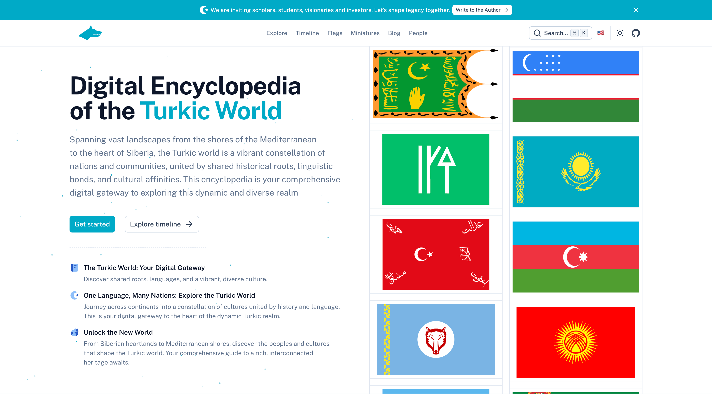

# Turkion

- [Live demo](https://www.turkion.org/)
- [Documentation](https://www.turkion.org/en/docs/essentials/documentation)

<a href="https://www.turkion.org/" target="_blank">
  <picture>
    <source media="(prefers-color-scheme: dark)" srcset="public/preview.png">
    <source media="(prefers-color-scheme: light)" srcset="public/preview.png">
    
  </picture>
</a>

## Quick Start


## Setup

Make sure to install the dependencies:

```bash
pnpm install
```

## Development Server

Start the development server on `http://localhost:3000`:

```bash
pnpm dev
```

## Production

Build the application for production:

```bash
pnpm build
```

Locally preview production build:

```bash
pnpm preview
```

Check out the [deployment documentation](https://nuxt.com/docs/getting-started/deployment) for more information.

## Renovate integration

Install [Renovate GitHub app](https://github.com/apps/renovate/installations/select_target) on your repository and you are good to go.
