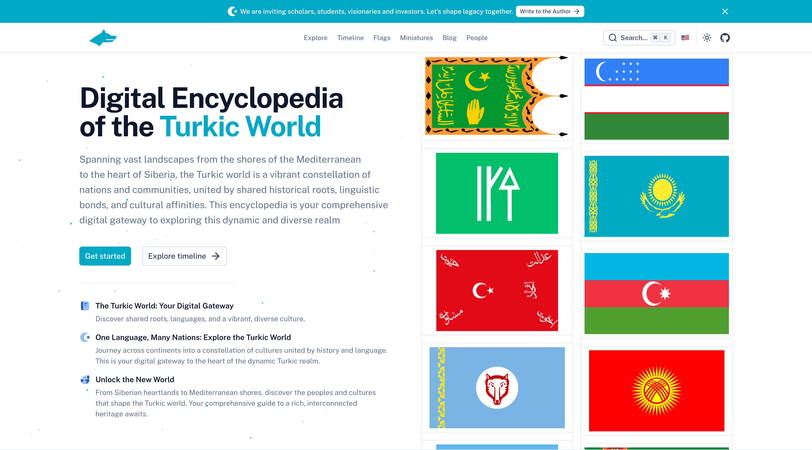

# Turkion

A digital encyclopedia of the Turkic world in English, Russian and Uzbek, built with Nuxt 4 and Nuxt Content.

- [Website](https://www.turkion.org/)
- [Encyclopedia](https://www.turkion.org/en/docs/common/turkic-peoples)
- [Contributor guide](https://www.turkion.org/en/docs/essentials/markdown-syntax)



## Setup

Use Node.js 22.18+ (CI uses Node 24) and pnpm 10.29.2, as declared in `package.json`.

```bash
pnpm install --frozen-lockfile
cp .env.example .env
pnpm dev
```

The development server defaults to http://localhost:3000. Set `NUXT_PUBLIC_SITE_URL` before building for a different domain; it controls canonical URLs, language alternates, sitemap and social metadata.

## Checks and production

```bash
pnpm content:check
pnpm media:check
pnpm test
pnpm lint
pnpm typecheck
pnpm build
```

`pnpm preview` starts an interactive production preview.

The build prerenders linked localized pages; Nuxt SSR handles other routes. Nuxt Image selects the deployment provider automatically (IPX for the Node server). Vercel Analytics is enabled when built on Vercel; `NUXT_PUBLIC_ANALYTICS_ENABLED` can override the runtime flag.

CI runs media checks, regression tests (including content validation), lint, type checking and a production build on pushes and pull requests.

## Content and media

- `content/{en,ru,uz}` contains localized YAML and Markdown. Preserve matching article paths across locales.
- Country subject articles require relevant `sources` entries with a title and HTTP(S) URL. `editorialStatus: draft` is explicit: references are not a claim of expert review.
- Timeline sections share stable IDs across languages. Check translations whenever an event changes.
- `content/media.yml` records image originals and verified or unverified attribution. Do not infer creators or licenses from filenames.
- Archival miniature originals live under `media/originals`; the public site uses smaller WebP derivatives. Run `pnpm media:prepare` to regenerate them with the checked-in processing script. Preserve the originals and mapping when changing image references.

Use `pnpm content:check` after edits to detect missing local assets, invalid routes, missing citations and locale mismatches. Historical claims and translations still require editorial review; automated checks validate structure, not historical truth.
